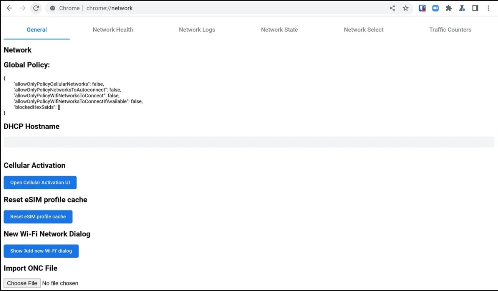

## BLackoutDNS

*Why need a proxy when you have a DNS?* - DotLYHiyou, Creator of this project.

This is a simple DNS server that gets around school firewall restrictions. Support to get around tools such as GoGuardian, CKAuth, or whatever other schools use as restriction tools. idk I only have access to GoGuardian. Built 80% using AI. Probably gonna rework it when I completely learn Javascript to its core and advanced stuff.

## How to use?

- # Step 1: Go to chrome:network#state
 You should see a section labeled "Favorite Networks"

- # Step 2: Navigate to the managed wifi network
    Click on the + next to it. You should see some text pop up.
    Copy ALL of the text. Make sure you don't leave out ONE thing.

- # Step 3: Paste the copied text into the text box in this link: [https://blackoutdns.vercel.app](https://blackoutdns.vercel.app)
    Then press the "Download .onc" button. You should get a file named "bdns.onc".

- # Step 4: Go to chrome://network#general
    Scroll down and click "Import ONC". Select the file you downloaded from the site.

# YAY! BlackoutDNS!!!

